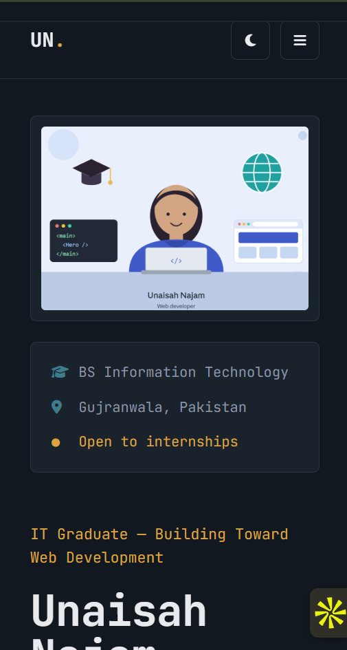
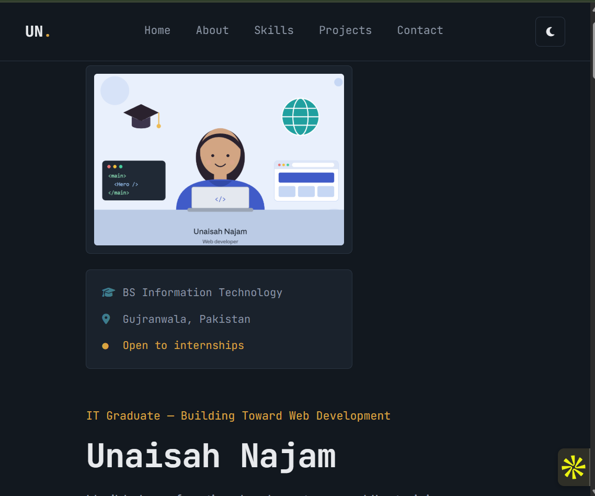
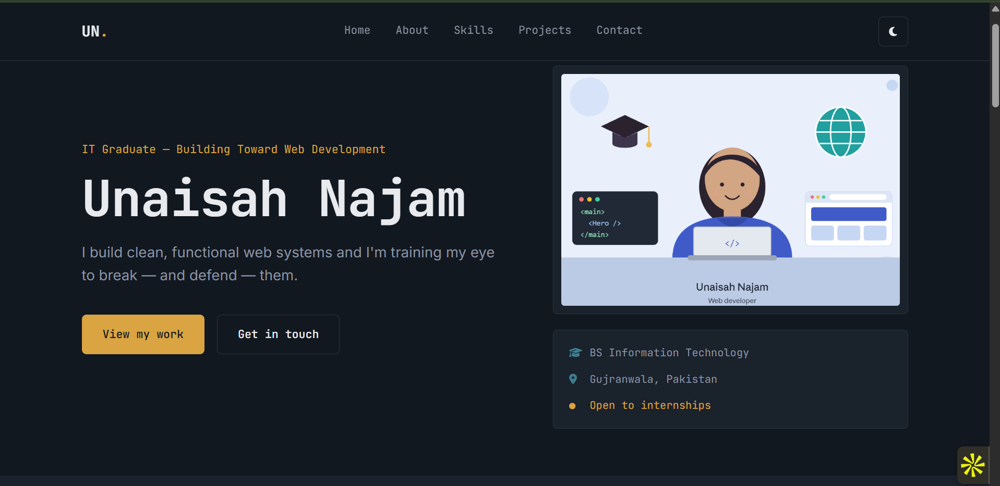

# Unaisah Najam — Portfolio Website

A single-page, fully responsive personal portfolio built with plain HTML5, CSS3 and vanilla JavaScript (ES6). No frameworks, no page builders, no build step.

## 🔗 Live site
https://tsg-webdev-p01-unaisah-najam.vercel.app/

## ✨ Features
- Fixed navigation bar with smooth-scroll links to Home, About, Skills, Projects and Contact
- Hero section with name, tagline, illustration and call-to-action button
- About section with a short bio and a downloadable CV
- Skills section with 8 skills, icons and progress bars
- Projects grid with 3 project cards (image, title, description, link)
- Contact form (name, email, message) with JavaScript validation
- Footer with copyright and social icons
- Dark / light mode toggle (saved in localStorage)
- Mobile hamburger menu
- Scroll-to-top button
- Responsive layout for mobile (360px), tablet (768px) and desktop (1440px)

## 🛠 Tech stack
HTML5 · CSS3 (Flexbox and Grid) · JavaScript (ES6) · Google Fonts (JetBrains Mono, Inter) · Font Awesome icons · Git and GitHub · GitHub Pages

## 📁 File structure
```
tsg-webdev-p01-Unaisah-Najam/
├── index.html
├── styles.css
├── script.js
├── README.md
├── Illustration.png, CV.png
├── BaskIt.png, Baskit-compressed.mp4
├── hotel management.jpg.png, Hotel management project.pdf
├── airline reservation system.jpg.png, Airline reservation project.pdf
└── screenshots (mobile, tablet, desktop)
```

## ⚙️ Setup
1. Clone the repository:
```bash
   git clone https://github.com/UnaisahNajam/tsg-webdev-p01-Unaisah-Najam.git
```
2. Open the folder and double-click `index.html` to view the site in your browser (or use the Live Server extension in VS Code).

## 🚀 Deployment
The site is deployed with GitHub Pages: Settings → Pages → Deploy from a branch → `main` / root.

## 📸 Screenshots

### Mobile (360px)


### Tablet (768px)


### Desktop (1440px)


## 🙏 Credits
- Fonts: Google Fonts (JetBrains Mono, Inter), open-source licences
- Icons: Font Awesome Free
- Hero illustration: created with Claude (Anthropic)
- Project screenshots and documents: my own work
